##### These procedure steps will be followed on the simulator

1. When you open CBR simulation, a window will open as shown below, click on Description to understand the terminologies, click on NEXT button to proceed. 
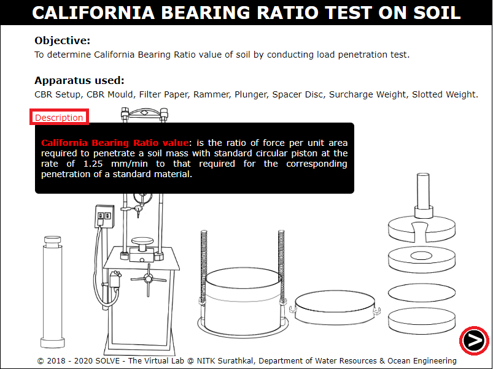 

2. Take 5kg soil sample passing through 20mm IS sieve. 
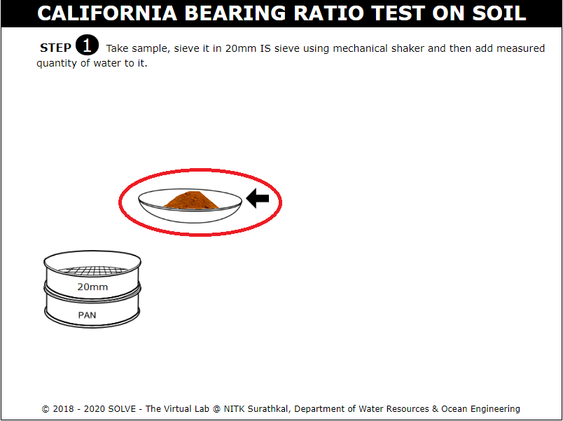 

3. Click on the set of sieves to place it in the mechanical shaker, click on ON button to start the shaker. 
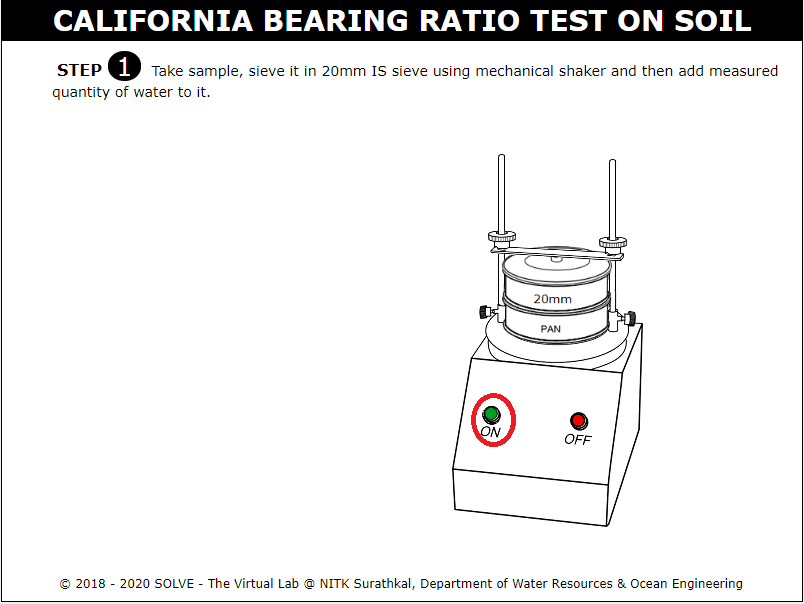 

4. Click on pan and weigh the soil sample retained on 20mm sieve using a weighing machine. 
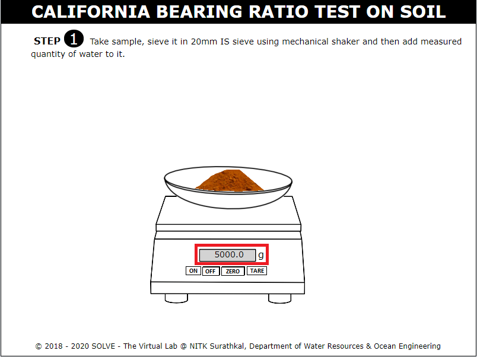 

5. Answer the question related to optimum moisture content to proceed with simulation. 
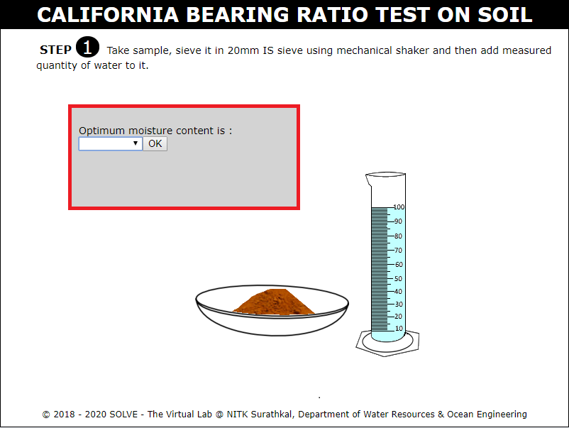 

6. Add the measured quantity of water taken to the soil sample. 
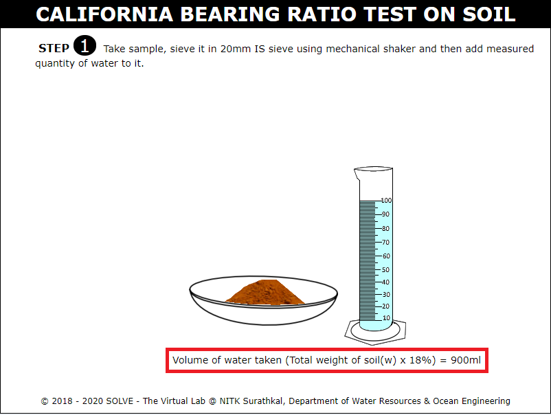 

7. Click on towel to mix the soil sample uniformly. 
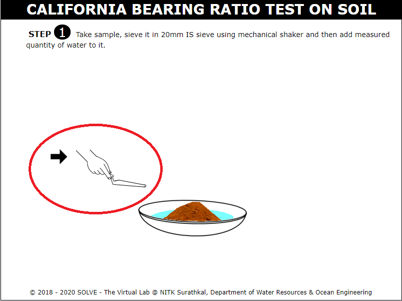 

8. Place the spacer disc over the base plate, click on coarse filter paper to place it on spacer disc. 
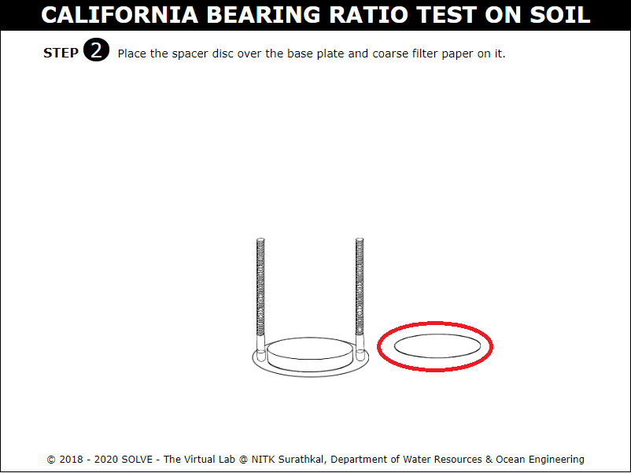 

9. Go through the instructions given to proceed with the simulation. 
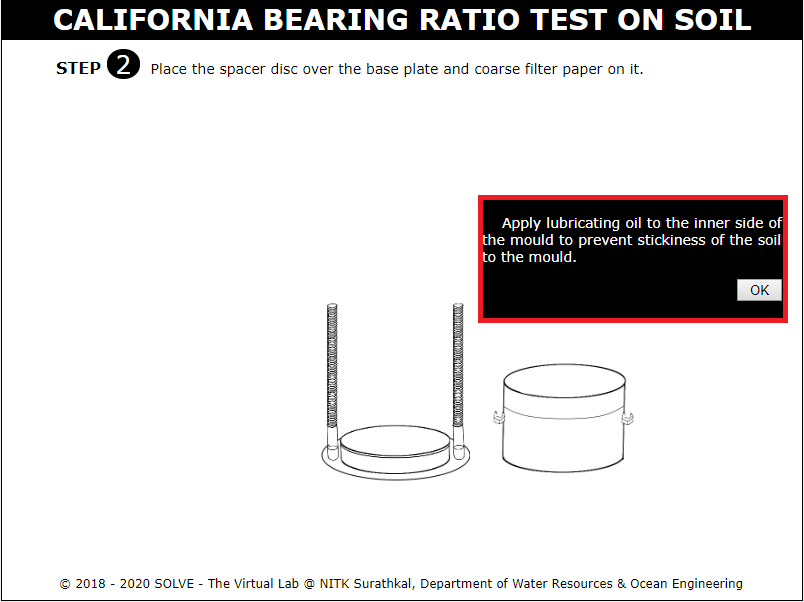 

10. Click on the trowel to fill 1/5 th of the mould. 
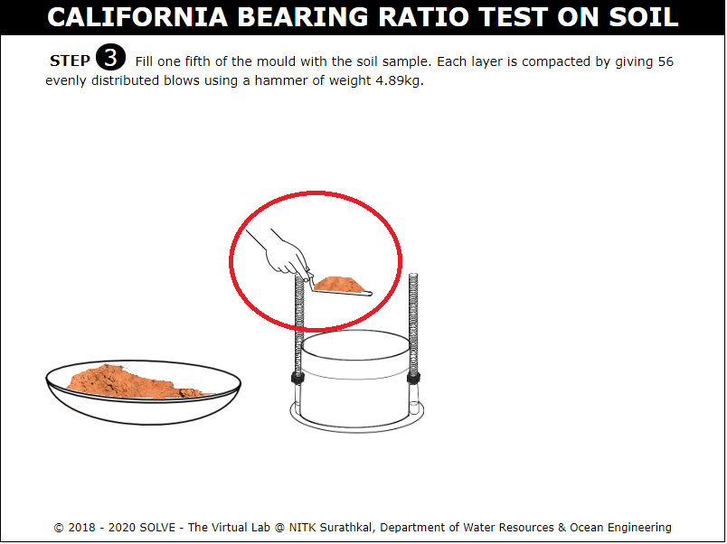 

11. Click on the hammer to compact soil in layers, each layer is compacted by giving 56 blows. 
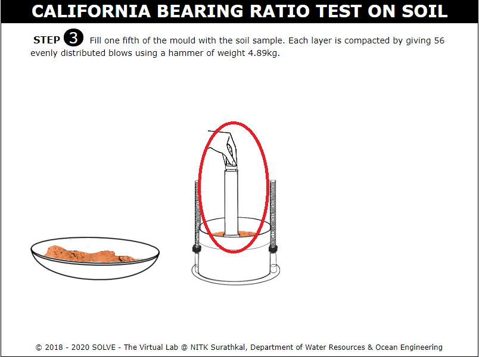 

12. Click on the mould to invert it, then place the filter paper in the setup below the mould, then click on surcharge weight to be placed above the mould. 
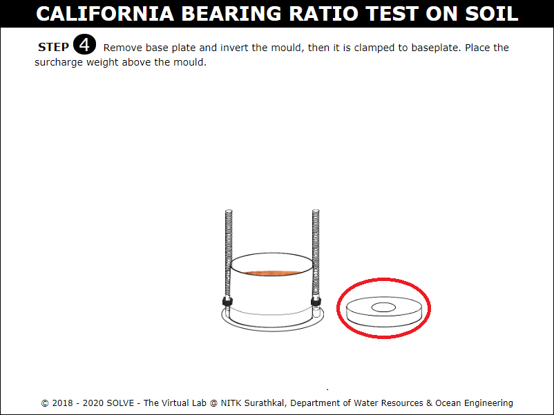 

13. Place the mould in position long with plunger, then apply the load. 
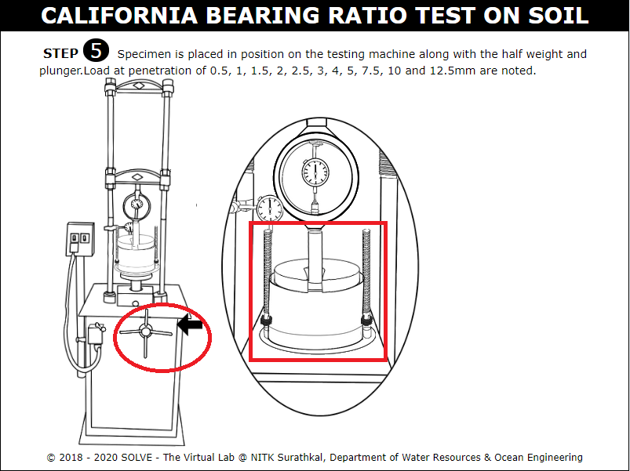 

14. Note down the proving ring reading for every 0.5mm increase in penetration. Click on NEXT button to proceed. 
 

15. Determine the load and axial load values, click on NEXT button to refer graph. 
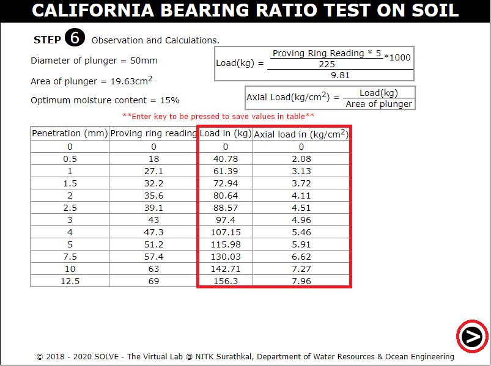 

16. View the graph of Penetration vs Axial Load. Click on NEXT button to proceed. 
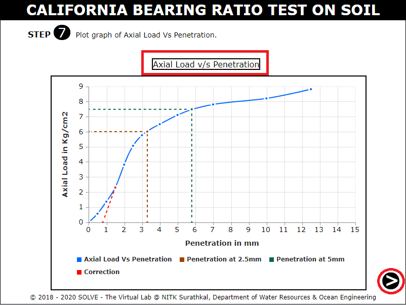 

17. Determine the value of CBR at 2.5 and 5mm penetration, answer the question with the help of hint provided. 
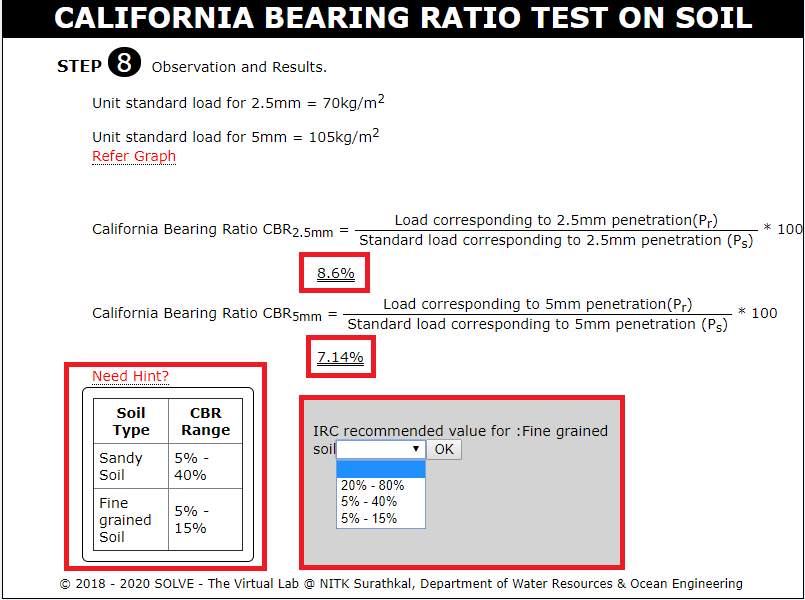 

18. Go through inference drawn from the obtained result. 
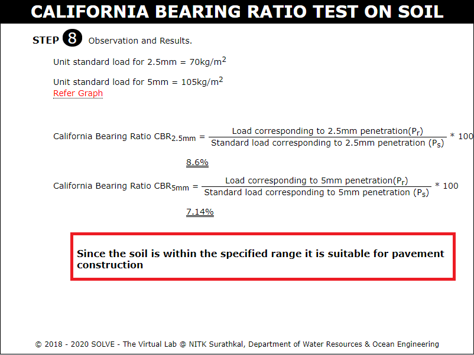 
