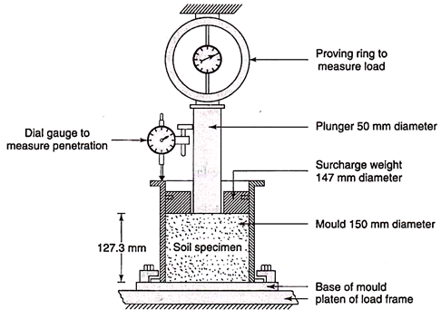
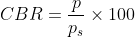

### INTRODUCTION 

The California Bearing Ratio (CBR) test is a penetration test meant for the estimation of subgrade strength of roads and pavements. The results found by these tests are used with the empirical curves to find the thickness of pavement and its component layers. This is the most commonly used method for the design of flexible pavement. California Division of Highway developed CBR test as a method of classifying and evaluating soil-sub grade and base course materials for flexible pavements. An empirical test, the CBR test has been used to find the material properties for pavement design.

It is a penetration test in which a standard piston, with a diameter of 3 in or 76 mm, is used to penetrate the soil at a standard rate of 1.25 mm/minute. The pressure up to a penetration of 12.5 mm and its ratio to the bearing value of a standard crushed rock is defined as CBR. In most of the cases, CBR value decreases as the penetration value increases. The ratio is usually determined for the penetration of 2.5mm and 5.0mm.

In some cases, the ratio at 5 mm may be greater than that at 2.5 mm. If this occurs, the ratio at 5 mm must be used. The CBR is a measure of resistance of a material to penetration of a standard plunger under controlled density and moisture conditions. The test procedure should be strictly adhered, if a high degree of reproducibility is desired.

The CBR test is conducted on a remolded or undisturbed specimen in the laboratory. The test is simple and has been widely investigated for field correlations of flexible pavement thickness condition.

CBR apparatus consists a mould of 150 mm diameter with a base plate and a collar, a loading frame and dial gauges for measuring the penetration values and the expansion on soaking. The specimen in the mould is soaked in water for four days and the swelling and water absorption values are noted. The surcharge weight is placed on the top of the specimen in the mould and the assembly is placed under the plunger of the loading frame.

Load is applied on the sample by a standard plunger with diameter of 50 mm at the rate of 1.25 mm/min. A load penetration curve is drawn. The load values on standard crushed stones are 1370 kg, 2055 kg, 2630 kg, 3180 kg and 3600 kg at 2.5 mm, 5.0 mm, 7.5 mm, 10.0 mm and 12.5 mm penetrations respectively. CBR value is defined as the percentage of the actual load causing the penetrations of 2.5 mm or 5.0 mm to the standard loads mentioned above. The test is carried out on the undisturbed specimens and on remoulded specimens which may be compacted either statically or dynamically. For light compaction, compact the soil in 3 equal layers, each layer being given 55 blows with 2.6 kg rammer. For heavy compaction compact the soil in 5 layers, 56 blows to each layer with 4.89 kg rammer.

Generally, the CBR value at 2.5 mm will be greater that at 5 mm and in such a casethe former shall be taken as CBR for design purpose. If CBR for 5 mm exceeds that for 2.5 mm, the test should be repeated. The CBR can therefore be mathematically expressed as below:

  

Schematic Diagram of CBR Experimental Setup 
 

Source: (<a href="http://www.soilmanagementindia.com/wp-content/uploads/2018/05/clip_image020_thumb-3.png">http://www.soilmanagementindia.com/wp-content/uploads/2018/05/clip_image020_thumb-3.png</a>)

 

Where,

 = measured pressure for site soils [ N/mm2]

 = pressure to achieve equal penetration on standard soil [ N/mm2 ]

The California Bearing Ratio (CBR) test is a strength test that compares the bearing capacity of a material with that of a well-graded crushed stone. The harder the surface, the higher the CBR value. Typically, a value of 2% equates to clay, while some sands may have a CBR value of 10%. High quality sub-base will have a value of between 80-100% (maximum).

As per IRC: 37-2001, if the maximum variation in CBR values among the three specimens tested in the laboratory exceed the permissible variation in CBR values for different ranges (as given in the table below), the CBR test should be repeated on additional three specimens and the average value of six specimens is to be accepted as the CBR value.

<table style="width:800px;margin-left: 0;text-align:center;">
<tr style="text-align:center">
<th style="text-align:center;height:50px;width:10%">CBR value (%)</th>
<th style="text-align:center;height:50px;width:10%">Maximum permissible variation in CBR values between 3 individual test value (±, %)</th>
</tr>
<tr style="text-align:center;height:50px;">
<td> &lt; 5</td>
<td> 1</td>
</tr>
<tr style="text-align:center;height:50px;">
<td>5 - 10</td>
<td>2</td>
</tr>
<tr style="text-align:center;height:50px;">
<td>11 - 30</td>
<td>3</td>
</tr>
<tr style="text-align:center;height:50px;">
<td>31 or above</td>
<td>5</td>
</tr>
</table>

(Source: The Constructor, Civil Engineering Home)
 

<strong>Relevant Indian Standard for CBR Test on Soil</strong>:

<ol style="text-indent:25px; text-align:justify;list-style-position: inside">
<li>IS 2720 (Part-16) : 1979 - Methods of Test for Soil : Laboratory Determination of CBR (Second Revision).</li>
<li>IS 2720 (Part 16) : 1987 - Methods of Test for Soil : Laboratory Determination of CBR (Second Revision). Reaffirmed- Dec 2016.</li>
</ol>
